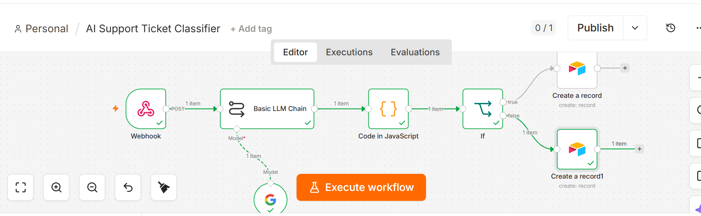
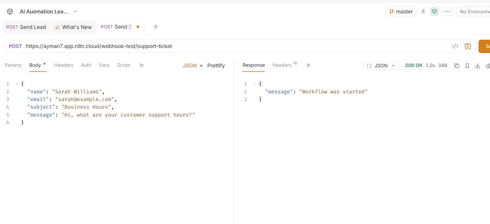
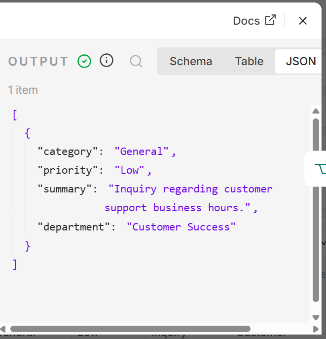
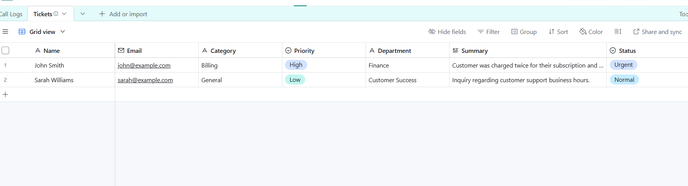

# AI Support Ticket Classifier

An AI-powered customer support automation workflow built with **n8n**, **Google Gemini**, **Webhook**, **Bruno**, and **Airtable**. The workflow receives support tickets through a webhook, uses AI to classify and prioritize them, and automatically routes them into the appropriate support queue.

---

## 🚀 Features

- 🌐 Receives support tickets via Webhook
- 🤖 Uses Google Gemini AI to classify customer issues
- ⚡ Automatically determines ticket priority (High or Low)
- 📝 Generates a concise AI summary of the issue
- 🏢 Assigns the correct department
- 📊 Stores tickets in Airtable
- 🔀 Routes urgent and normal tickets automatically
- 🧪 Includes API testing with Bruno

---

## 🛠️ Tech Stack

- n8n
- Google Gemini
- Webhooks
- Airtable
- Bruno
- JavaScript (Code Node)

---

## 📌 Workflow

```text
Customer Support Form
        │
        ▼
Webhook
        │
        ▼
Google Gemini AI
(Classify Ticket)
        │
        ▼
Code Node
(Parse JSON)
        │
        ▼
IF Node
(Priority Check)
   │            │
   ▼            ▼
Urgent      Normal
   │            │
   ▼            ▼
Airtable   Airtable
```

---

## 📂 Repository Structure

```
ai-support-ticket-classifier/
│
├── workflow.json
├── README.md
├── .gitignore
└── screenshots/
    ├── workflow.png
    ├── webhook.png
    ├── bruno-request.png
    ├── gemini-output.png
    ├── code-node.png
    ├── airtable.png
    └── execution.png
```

---

## ⚙️ How It Works

1. A customer submits a support request.
2. The Webhook receives the request in JSON format.
3. Google Gemini analyzes the ticket.
4. AI classifies:
   - Category
   - Priority
   - Department
   - Summary
5. A JavaScript Code node parses the AI response.
6. The IF node checks whether the ticket is High or Low priority.
7. The ticket is stored in Airtable with the appropriate status.

---

## 🤖 Example Input

```json
{
  "name": "John Smith",
  "email": "john@example.com",
  "subject": "Refund Request",
  "message": "I was charged twice for my subscription and need an immediate refund."
}
```

---

## 🤖 Example AI Output

```json
{
  "category": "Billing",
  "priority": "High",
  "summary": "Customer was charged twice and requested a refund.",
  "department": "Finance"
}
```

---

## 📸 Screenshots

### Complete Workflow



---


### Bruno API Request



---

### Gemini Classification



---

### Airtable Database




---

## 💼 Business Use Cases

- SaaS Companies
- Customer Support Teams
- Help Desks
- E-commerce Stores
- IT Service Providers
- CRM Automation
- Internal IT Ticketing

---

## 🔧 Requirements

- n8n
- Google Gemini API Key
- Airtable Account
- Bruno (for API testing)

---

## 🚀 Future Improvements

- Slack notifications for urgent tickets
- Automatic email acknowledgements
- CRM integration (HubSpot, Salesforce)
- Sentiment analysis
- Auto-assignment to support agents
- Dashboard for ticket analytics
- Knowledge base suggestions
- Multi-language support

---

## 📚 Skills Demonstrated

- AI Workflow Automation
- Webhook Development
- REST API Integration
- Prompt Engineering
- JSON Processing
- JavaScript in n8n
- Conditional Logic
- Database Automation
- Customer Support Automation

---

## 👨‍💻 Author

**Ayman Amjad**

GitHub: https://github.com/Ayman-A7

---

⭐ If you found this project useful, consider giving it a star!
